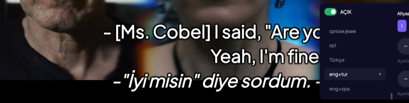

# Stremio Dual Subtitles

A Stremio addon that displays **two subtitle languages simultaneously** - designed for language learners who want to watch movies and TV series with bilingual subtitles.

[](https://stremio-dual-subtitles.vercel.app)
[](LICENSE)
[](https://nodejs.org/)
[](https://www.stremio.com/)

---

## Table of Contents

- [Demo](#demo)
- [Features](#features)
- [Installation](#installation)
- [Configuration](#configuration)
- [Usage Guide](#usage-guide)
- [Project Structure](#project-structure)
- [Technical Details](#technical-details)
- [API Reference](#api-reference)
- [Performance](#performance)
- [FAQ](#faq)
- [Troubleshooting](#troubleshooting)
- [Roadmap](#roadmap)
- [Changelog](#changelog)
- [Contributing](#contributing)
- [Support](#support)
- [License](#license)
- [Credits](#credits)

---

## Demo



*Primary language on top in bold, secondary below with a marker and (where the player supports SRT styling) italic and a softer color. Actual appearance depends on the Stremio client.*

**Live Instance:** [stremio-dual-subtitles.vercel.app](https://stremio-dual-subtitles.vercel.app)

---

## Features

| Feature | Description |
|---------|-------------|
| **Multi-Source Scrapers** | Scrapes OpenSubtitles v3, Subdl, and Vietnamese subtitle sources in parallel for max coverage |
| **User-Selectable Dual Tracks** | Choose between different provider source pairs directly in Stremio's Addons menu |
| **Anime & Kitsu Support** | Resolves Kitsu, MAL, AniList, and TMDB media IDs automatically via ARM API |
| **Dual Display** | Two languages at once - primary line emphasized, second line with a visible marker and softer styling where supported |
| **70+ Languages** | Full subtitle language support including rare languages and CJK formatting |
| **Smart Sync** | Intelligent time-based subtitle merging algorithm with drift alignment |
| **Encoding Support** | UTF-8, UTF-16, Windows codepages, ISO-8859 variants, VTT & SRT |
| **No Registration** | Works instantly without API keys or accounts |
| **Privacy First** | No personal data collection, fully open source |
| **Modern UI** | Clean, responsive landing page with live preview |
| **Analytics** | Built-in usage statistics dashboard |
| **1-Click Deployment** | Ready for Vercel, Railway, Render, Docker, or Node.js |

---

## Installation

### Option 1: Public Instance (Recommended)

The fastest way to get started - no installation required.

1. Open your browser and visit **[stremio-dual-subtitles.vercel.app](https://stremio-dual-subtitles.vercel.app)**
2. Select your **Primary Language** (the language you're learning)
3. Select your **Secondary Language** (your native language)
4. Click **"Install to Stremio"**
5. Stremio will open automatically with the addon configured
6. Open any movie or series and select the dual subtitle option from the subtitle menu

### Option 2: Self-Hosted (Local)

Run your own instance for development or privacy.

**Prerequisites:**
- [Node.js](https://nodejs.org/) v18.0.0 or higher (20.x LTS recommended)
- [npm](https://www.npmjs.com/) v9.0.0 or higher
- [Stremio](https://www.stremio.com/) installed on your device

**Step-by-step:**

```bash
# 1. Clone the repository
git clone https://github.com/ummugulsunn/stremio-dual-subtitles.git

# 2. Navigate to project directory
cd stremio-dual-subtitles

# 3. Install dependencies
npm install

# 4. (Optional) Configure environment variables
cp .env.example .env
# Edit .env with your preferred settings

# 5. Start the server
npm start

# 6. Open in browser
# Visit http://localhost:7000/configure
```

The server will display:
```
Dual Subtitles Addon Started
Local: http://localhost:7000/configure
Network: http://<your-ip>:7000/configure
```

### Option 3: Deploy to Vercel

Deploy your own cloud instance for free.

**One-Click Deploy:**

[](https://vercel.com/new/clone?repository-url=https://github.com/ummugulsunn/stremio-dual-subtitles)

**Manual Deploy:**

```bash
# Install Vercel CLI
npm install -g vercel

# Login to Vercel
vercel login

# Deploy
vercel --prod
```

### Option 4: Docker (Coming Soon)

```bash
docker pull ummugulsunn/stremio-dual-subtitles
docker run -p 7000:7000 ummugulsunn/stremio-dual-subtitles
```

---

## Configuration

### Environment Variables

Create a `.env` file in the project root:

```bash
cp .env.example .env
```

| Variable | Default | Required | Description |
|----------|---------|----------|-------------|
| `PORT` | `7000` | No | Server port number |
| `HOST` | `0.0.0.0` | No | Host to bind the server |
| `EXTERNAL_URL` | auto-detect | No | Public URL for remote access |
| `ANALYTICS_SECRET` | - | No | Secret key to protect `/stats` endpoint |
| `DEBUG_MODE` | `false` | No | Enable verbose server logging |
| `RATE_LIMIT_MAX` | `60` | No | Max requests per IP per minute |

### Network Access Setup

To use the addon on other devices in your network (TV, phone, tablet):

1. **Find your computer's local IP address:**
   - Windows: `ipconfig` in Command Prompt
   - macOS/Linux: `ifconfig` or `ip addr` in Terminal
   - Example: `192.168.1.100`

2. **Set the external URL:**
   ```bash
   EXTERNAL_URL=http://192.168.1.100:7000
   ```

3. **Restart the server**

4. **Access from other devices:**
   - Open `http://192.168.1.100:7000/configure` on your TV/phone
   - Install the addon from there

### Firewall Configuration

Ensure port 7000 (or your chosen port) is open:

```bash
# macOS
sudo /usr/libexec/ApplicationFirewall/socketfilterfw --add /usr/local/bin/node

# Linux (ufw)
sudo ufw allow 7000

# Windows
# Add inbound rule for port 7000 in Windows Firewall
```

---

## Usage Guide

### For Language Learning

**Recommended Setup:**
1. Set the language you're **learning** as the **Primary Language** (displayed on top)
2. Set your **native language** as the **Secondary Language** (shown on the second line with a marker and softer styling where the player supports it)
3. This way, you try to read and understand the primary language first, then verify with your native language

**Learning Tips:**
- Focus on reading the top subtitle first
- Only glance at the bottom subtitle when needed
- Pause on difficult scenes and repeat
- Take notes on new vocabulary
- Start with content you've seen before in your native language

### Best Content for Learning

| Content Type | Why It Works |
|--------------|--------------|
| **TV Series** | Consistent vocabulary, recurring characters and contexts |
| **Animated Films** | Clear pronunciation, simpler vocabulary |
| **Romantic Comedies** | Everyday conversational language |
| **Documentaries** | Formal vocabulary, clear narration |
| **Children's Content** | Simple language, slow speech |

### Subtitle Selection in Stremio

1. Start playing any movie or series
2. Click the **subtitle icon** (CC) in the player
3. Look for options labeled with your language combination (e.g., "English + Turkish")
4. Select the dual subtitle option
5. Subtitles will appear with both languages

**Android TV compatibility note:**
- Dual subtitles are published with a standard single `lang` code for maximum client compatibility
- Because of this, your dual subtitle option appears under your **Primary Language** group in Stremio's subtitle list
- The dual entry remains easy to identify by its title format: `Dual (ENG+TUR) - English + Turkish`

---

## Project Structure

```
stremio-dual-subtitles/
├── addon.js              # Core addon logic
│                         # - Subtitle fetching from OpenSubtitles
│                         # - SRT parsing and merging algorithm
│                         # - Dynamic subtitle generation
│
├── server.js             # Express server
│                         # - Route handlers
│                         # - Rate limiting
│                         # - Static file serving
│                         # - SEO endpoints
│
├── encoding.js           # Character encoding utilities
│                         # - Auto-detection
│                         # - Conversion to UTF-8
│
├── languages.js          # Language configuration
│                         # - 70+ language mappings
│                         # - Code aliases
│
├── landingTemplate.js    # Landing page HTML
│                         # - Configuration UI
│                         # - Live preview
│                         # - SEO meta tags
│
├── lib/
│   ├── analytics.js      # Usage tracking
│   ├── debug.js          # Logging utilities
│   └── templates.js      # HTML templates (stats, privacy, errors)
│
├── public/
│   ├── logo.png          # Addon logo (512x512)
│   └── demo.png          # Demo screenshot
│
├── .github/
│   └── workflows/
│       └── ci.yml        # GitHub Actions CI/CD
│
├── vercel.json           # Vercel deployment config
├── package.json          # Dependencies and scripts
├── .env.example          # Environment template
├── CHANGELOG.md          # Version history
└── README.md             # Documentation
```

---

## Technical Details

### Subtitle Processing Pipeline

```
1. Request received (movie/series ID + language config)
         ↓
2. Fetch available subtitles from OpenSubtitles API
         ↓
3. Filter by selected languages
         ↓
4. Download best matching subtitle files
         ↓
5. Detect and convert character encoding
         ↓
6. Parse SRT format (timing + text)
         ↓
7. Merge based on timestamp overlap
         ↓
8. Generate combined SRT output
         ↓
9. Return to Stremio player
```

### Merging Algorithm

The addon uses a time-based matching algorithm:

1. For each primary subtitle entry, find overlapping secondary entries
2. Match based on start/end time proximity (within 1 second tolerance)
3. Combine matched entries: primary line uses `<b>`, secondary line uses a `›` prefix plus `<i>` and a muted `<font color>` when the player renders HTML in SRT
4. Handle edge cases: missing translations, timing gaps

### Supported Encodings

| Category | Encodings |
|----------|-----------|
| Unicode | UTF-8, UTF-16 LE, UTF-16 BE |
| Windows | CP1250, CP1251, CP1252, CP1253, CP1254, CP1255, CP1256, CP1257, CP1258 |
| ISO | ISO-8859-1 through ISO-8859-15 |
| Other | KOI8-R, KOI8-U, GB2312, GBK, Big5, EUC-KR, Shift_JIS |

---

## API Reference

### Public Endpoints

| Method | Endpoint | Description |
|--------|----------|-------------|
| GET | `/` | Redirect to `/configure` |
| GET | `/configure` | Landing page with configuration UI |
| GET | `/manifest.json` | Base addon manifest |
| GET | `/health` | Health check (returns JSON status) |
| GET | `/privacy` | Privacy policy page |
| GET | `/robots.txt` | SEO robots file |
| GET | `/sitemap.xml` | SEO sitemap |

### Stremio Addon Endpoints

| Method | Endpoint | Description |
|--------|----------|-------------|
| GET | `/:config/manifest.json` | Configured manifest |
| GET | `/:config/subtitles/:type/:id.json` | Subtitle list for content |
| GET | `/subs/:type/:imdbId/:season/:episode/:mainLang/:transLang/:mainSubId/:transSubId.srt` | Generated subtitle file |

### Protected Endpoints

| Method | Endpoint | Auth | Description |
|--------|----------|------|-------------|
| GET | `/stats?key=SECRET` | Query param | Analytics dashboard |

### Example Requests

```bash
# Health check
curl https://stremio-dual-subtitles.vercel.app/health

# Get manifest
curl https://stremio-dual-subtitles.vercel.app/manifest.json

# Get subtitles for a movie (English + Turkish)
curl "https://stremio-dual-subtitles.vercel.app/English%20%5Beng%5D%7CTurkish%20%5Btur%5D/subtitles/movie/tt0111161.json"
```

---

## Performance

### Response Times

| Operation | Average | P95 |
|-----------|---------|-----|
| Health check | <50ms | <100ms |
| Manifest | <100ms | <200ms |
| Subtitle list | 500ms-2s | <5s |
| Subtitle file | 200ms-1s | <3s |

*Note: Subtitle operations involve external API calls to OpenSubtitles.*

### Optimization Features

- **Gzip Compression**: All responses are compressed
- **Static Asset Caching**: 24-hour cache for logos and images
- **Subtitle Caching**: 6-hour in-memory cache (local mode)
- **Rate Limiting**: 60 requests/minute per IP to prevent abuse

### Resource Usage

| Metric | Value |
|--------|-------|
| Memory (idle) | ~50MB |
| Memory (under load) | ~150MB |
| CPU (idle) | <1% |
| Startup time | <2s |

---

## FAQ

**Q: Is this addon free?**
A: Yes, completely free and open source. No premium features or hidden costs.

**Q: Do I need to create an account?**
A: No. The addon works without any registration or API keys.

**Q: Does this work with all movies and series?**
A: It works with any content that has subtitles available on OpenSubtitles. Popular content has better coverage.

**Q: Can I use this on my TV?**
A: Yes. Install Stremio on your TV, then add the addon using the manifest URL or by setting up network access from your computer.

**Q: Why are some subtitles missing translations?**
A: If OpenSubtitles doesn't have subtitles for your chosen language pair for that specific content, no dual subtitles will be available.

**Q: Is my data collected?**
A: No personal data is collected. Anonymous usage statistics (page views, language preferences) may be tracked for analytics purposes only.

**Q: Can I use more than two languages?**
A: Currently, only two languages are supported (primary + secondary). Multi-language support may be added in the future.

**Q: Why do song lyrics not have translations?**
A: Some subtitle files only translate dialogue, not song lyrics. This depends on the original subtitle file from OpenSubtitles.

**Q: How do I report a bug?**
A: Open an issue on [GitHub](https://github.com/ummugulsunn/stremio-dual-subtitles/issues) with details about the problem.

---

## Troubleshooting

### Subtitles Not Showing

1. **Check subtitle availability**: Not all content has subtitles for all languages
2. **Try different content**: Test with popular movies that have wide subtitle coverage
3. **Reinstall addon**: Remove and reinstall the addon in Stremio
4. **Clear Stremio cache**: Settings > Clear Cache in Stremio
5. **Check language selection**: Ensure you selected two different languages

### Encoding Issues (Garbled Text)

1. The addon auto-detects encoding for most files
2. Some rare encodings may not be supported
3. Report the issue with the movie/series title for investigation

### Connection Problems

1. **Firewall**: Ensure port 7000 is allowed
2. **URL**: Use IP address, not `localhost`, for network access
3. **EXTERNAL_URL**: Set correctly in `.env` for remote access

### Addon Installation Fails

1. **Multiple addons**: Remove all existing Dual Subtitles addons first
2. **Stremio restart**: Completely quit and restart Stremio
3. **Direct URL**: Try installing via manifest URL directly

### Server Won't Start

1. **Port in use**: Change PORT in `.env` or kill the process using port 7000
2. **Node version**: Ensure Node.js 18+ is installed
3. **Dependencies**: Run `npm install` again

---

## Roadmap

### Planned Features

| Feature | Status | Target |
|---------|--------|--------|
| Docker support | Planned | Q2 2026 |
| Custom subtitle styling | Planned | Q2 2026 |
| Offline subtitle caching | In Progress | Q2 2026 |
| Third language support | Considering | Q3 2026 |
| Mobile app | Considering | Q4 2026 |
| Browser extension | Considering | Q4 2026 |

### Known Limitations

- Requires internet connection for subtitle fetching
- Dependent on OpenSubtitles availability
- Serverless (Vercel) has 10-second timeout limit
- In-memory cache doesn't persist across serverless invocations

---

## Changelog

### v1.1.0 (2026-02-04)

**Added**
- Professional landing page with live preview
- Analytics dashboard with usage statistics
- SEO optimization (meta tags, sitemap, robots.txt)
- Dynamic subtitle generation for serverless compatibility
- 40+ language preview translations
- Custom error pages (404, 500, 429)
- Privacy policy page
- GitHub Actions CI/CD pipeline

**Changed**
- Optimized subtitle processing (1 version instead of 3)
- Improved encoding detection
- Updated README with comprehensive documentation

**Fixed**
- Serverless subtitle caching issue
- Character encoding for Turkish and Cyrillic languages

### v1.0.0 (2026-02-03)

**Initial Release**
- Dual subtitle display
- 70+ language support
- OpenSubtitles integration
- Stremio addon SDK implementation
- Basic landing page
- Local caching

---

## Contributing

Contributions are welcome. Please follow these guidelines:

### Getting Started

1. Fork the repository
2. Clone your fork: `git clone https://github.com/YOUR_USERNAME/stremio-dual-subtitles.git`
3. Create a branch: `git checkout -b feature/your-feature-name`
4. Make your changes
5. Test thoroughly
6. Commit with clear messages: `git commit -m "feat: add feature description"`
7. Push: `git push origin feature/your-feature-name`
8. Open a Pull Request

### Commit Convention

Use [Conventional Commits](https://www.conventionalcommits.org/):

- `feat:` New feature
- `fix:` Bug fix
- `docs:` Documentation changes
- `style:` Code style (formatting, semicolons, etc.)
- `refactor:` Code refactoring
- `perf:` Performance improvements
- `test:` Adding tests
- `chore:` Maintenance tasks

### Code Style

- Use ESLint configuration provided
- 2 spaces for indentation
- Single quotes for strings
- Semicolons required
- Document complex functions with JSDoc

---

## Support

### Getting Help

- **Documentation**: Read this README thoroughly
- **Issues**: [GitHub Issues](https://github.com/ummugulsunn/stremio-dual-subtitles/issues)
- **Discussions**: [GitHub Discussions](https://github.com/ummugulsunn/stremio-dual-subtitles/discussions)

### Reporting Bugs

When reporting bugs, please include:

1. Steps to reproduce
2. Expected behavior
3. Actual behavior
4. Browser/Stremio version
5. Operating system
6. Screenshots if applicable

### Feature Requests

Open an issue with the `enhancement` label describing:

1. The feature you'd like
2. Why it would be useful
3. How it might work

---

## License

This project is licensed under the MIT License.

```
MIT License

Copyright (c) 2026 Dual Subtitles

Permission is hereby granted, free of charge, to any person obtaining a copy
of this software and associated documentation files (the "Software"), to deal
in the Software without restriction, including without limitation the rights
to use, copy, modify, merge, publish, distribute, sublicense, and/or sell
copies of the Software, and to permit persons to whom the Software is
furnished to do so, subject to the following conditions:

The above copyright notice and this permission notice shall be included in all
copies or substantial portions of the Software.

THE SOFTWARE IS PROVIDED "AS IS", WITHOUT WARRANTY OF ANY KIND, EXPRESS OR
IMPLIED, INCLUDING BUT NOT LIMITED TO THE WARRANTIES OF MERCHANTABILITY,
FITNESS FOR A PARTICULAR PURPOSE AND NONINFRINGEMENT. IN NO EVENT SHALL THE
AUTHORS OR COPYRIGHT HOLDERS BE LIABLE FOR ANY CLAIM, DAMAGES OR OTHER
LIABILITY, WHETHER IN AN ACTION OF CONTRACT, TORT OR OTHERWISE, ARISING FROM,
OUT OF OR IN CONNECTION WITH THE SOFTWARE OR THE USE OR OTHER DEALINGS IN THE
SOFTWARE.
```

---

## Credits

**Built with:**
- [Stremio Addon SDK](https://github.com/Stremio/stremio-addon-sdk)
- [Express.js](https://expressjs.com/)
- [Node.js](https://nodejs.org/)

**Subtitle Source:**
- [OpenSubtitles](https://www.opensubtitles.org/)

**Inspired by:**
- [Strelingo Addon](https://github.com/Serkali-sudo/strelingo-addon)

---

**Made with dedication for language learners worldwide.**
